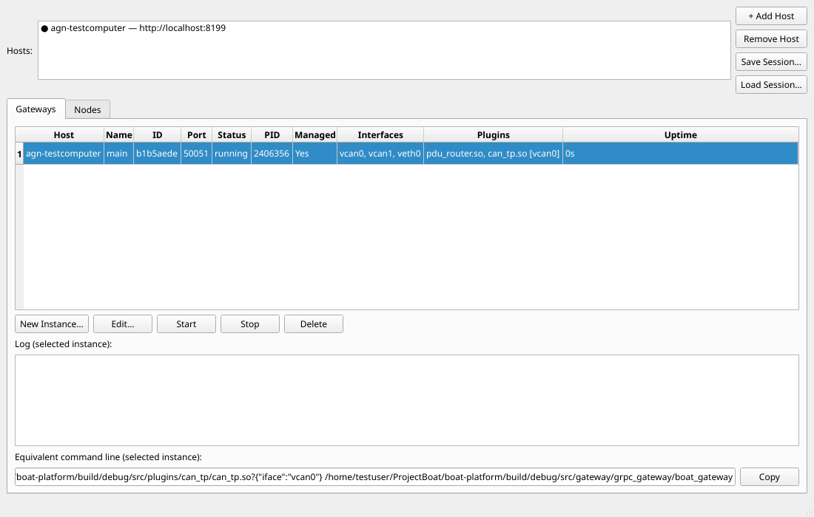
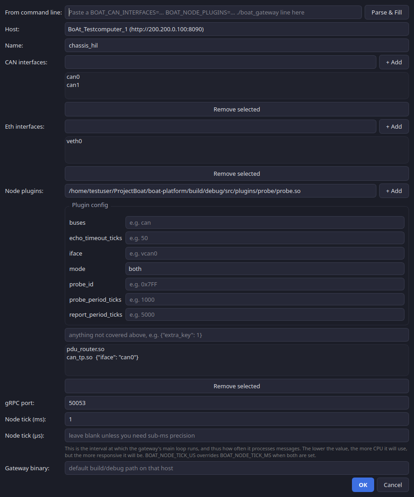
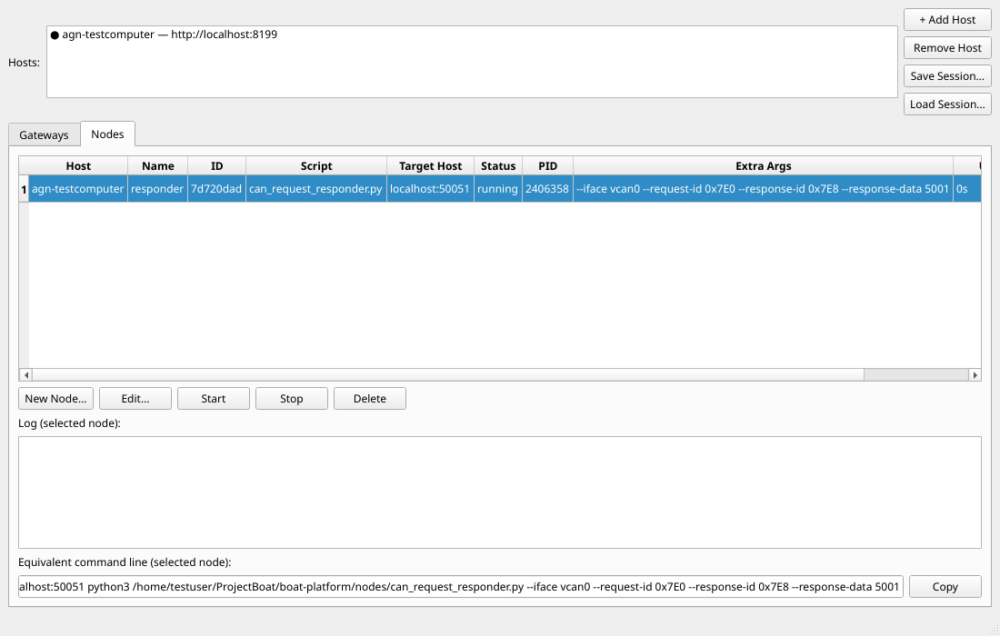
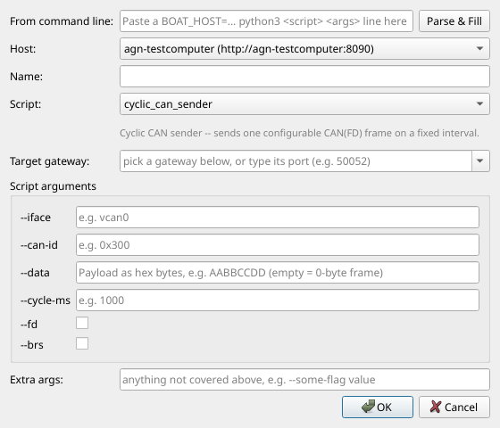

# BoAt Admin

A PySide6 desktop client for one or more `ui/launcher_agent.py` instances.
Add a host per machine that runs gateways; the app polls each host's REST API
and shows one aggregated table of every gateway instance across all of them,
across two tabs: **Gateways** (`boat_gateway` processes) and **Nodes**
(scripts under `boat-platform/nodes/`, see `AGENTS.md`).

No SSH is involved anywhere in this app — it only ever calls each agent's own
HTTP API, and each agent only ever touches processes on its own machine. See
`AGENTS.md`'s "Launcher Agent" section and `backlog/launcher_agent_backlog.md`
for the architecture rationale and current scope/gaps.

## Install & run

```bash
pip install -r admin_gui/requirements.txt      # Debian/Ubuntu with PEP 668
                                                 # ("externally-managed-environment"):
                                                 # add --break-system-packages, or use a venv
python3 admin_gui/main.py
```

Runs on any platform PySide6 supports (Windows, Linux, macOS) — it's a plain
HTTP client, so it doesn't need to run on the same machine as any gateway.

**Linux only:** Qt6's `xcb` platform plugin additionally needs a *system*
library that `pip install pyside6` does not provide:

```bash
sudo apt install libxcb-cursor0
```

Without it you'll see `qt.qpa.plugin: Could not load the Qt platform plugin
"xcb"` and the app aborts immediately on launch. This is a one-time,
per-machine system dependency, unrelated to the Python packages above (and
unrelated to whether you're on a real desktop or connecting via RDP/VNC —
either way it's the same `xcb` plugin doing the rendering).





## Usage

1. **Add Host** — display name + agent URL (e.g. `agn-testcomputer:8090`;
   `http://` is added automatically if omitted). Each host needs
   `ui/launcher_agent.py` already running there (`python3 ui/launcher_agent.py`,
   default port 8090). Hosts persist across runs in `~/.boat/admin_hosts.json`.
   **Save Session…** / **Load Session…** capture/restore *all* hosts and
   their agent-managed instance definitions at once, docker-compose-style
   — see the dedicated section below.
2. The instance table (Host, Name, ID, Port, Status, PID, **Managed**,
   Interfaces, Plugins, Uptime) aggregates every instance from every added
   host, refreshing every 2 seconds. A host's dot in the host list is
   filled (●) when reachable, hollow (○) when not. **Plugins** shows each
   plugin's `.so` basename, with the interface it's bound to in brackets
   when its config carries one (`can_tp.so [vcan0]`). **Managed** is
   `Yes` for instances this agent created, or `No` for a `boat_gateway`
   the agent found already running on that host but didn't start itself
   (started by hand, by a script, or by a now-exited earlier agent process)
   — its port/interfaces/plugins are recovered from the process's own
   environment (`/proc/<pid>/environ`) and shown the same as any other row.
   `Edit`/`Start`/`Delete` don't apply to an unmanaged row (there's no
   stored definition to act on) and are refused with a clear message;
   `Stop` still works — it's a plain signal by pid, which doesn't care who
   spawned the process.
3. **New Instance…** picks a host, then defines CAN interfaces, Eth
   interfaces, and node plugins via a dropdown + **+ Add** pattern: each
   dropdown is pre-populated from that host's `GET /api/host/info`
   (interfaces it actually has, plugin `.so` files discovered under its
   `build/{debug,release}`), but stays editable — type anything not listed
   (e.g. an interface you're about to create) and **+ Add** still accepts
   it. Selecting a plugin also builds a **Plugin config** field per key its
   config schema declares, if it has one — a `<name>.schema.json` sidecar
   file next to its `.so` (see `cmake/BoAtPlugin.cmake`), since a compiled
   `.so` has nothing to introspect at runtime the way a node script's
   `build_parser()` does. Each field shows an `e.g. <default>` placeholder
   (an enum key renders as a dropdown of its allowed values instead); a
   plugin with no sidecar schema — or any key not covered by one — falls
   back to the flat optional JSON config field alongside the path (e.g.
   `{"iface": "vcan0"}`), same as before this existed. **Remove selected**
   drops an already-added entry. Also: an optional explicit gRPC port
   (blank = auto-allocated by that host's agent), and an optional gateway
   binary override.
   At the top, **From command line** takes a pasted
   `BOAT_CAN_INTERFACES=... BOAT_NODE_PLUGINS=... ./boat_gateway` line
   (exactly what the "Equivalent command line" panel below produces) and
   **Parse && Fill** populates every field above from it in one shot —
   the reverse direction of that panel.
4. Select a row, then **Start** / **Stop** / **Delete** act on it (Delete is
   refused by the agent while the instance is running). **Edit…** reopens
   the same dialog pre-filled with that instance's current definition
   (host locked -- an instance can't move agents) and submits an update in
   place, same id, same rules as Delete: refused by the agent while running.
5. Below the log panel, **Equivalent command line** shows the
   `BOAT_CAN_INTERFACES=... BOAT_NODE_PLUGINS=... ./boat_gateway` form of
   whatever instance is selected -- for copying into a script (**Copy**
   button included). Updates automatically as the selection or that
   instance's config changes.

## Nodes tab





Same shape as the Gateways tab (table, New/Edit/Start/Stop/Delete, log
viewer, equivalent command line), driving script processes under
`boat-platform/nodes/` instead of `boat_gateway`. Differences from
Gateways, since a node has no port to allocate or ifaces/plugins of its
own:

- **New Node…**'s **Script** dropdown is populated from the selected
  host's discovered `boat-platform/nodes/*.py` files, with each script's
  module docstring shown underneath once picked.
- **Target gateway** is the `BOAT_HOST` value set in the spawned node's
  environment -- a dropdown spanning *every configured host's* gateway
  instances, not just the one the node itself will run on. Entries on the
  **same** host as the node (`main — localhost:50051 (running)`) resolve
  to `localhost:<port>` -- robust, no DNS involved, and correct, since
  they're the literal same machine. Entries on a **different** host are
  tagged and resolve to that host's own address instead (`[secondary-box]
  main — secondary-box:50051 (running)`) -- taken from that host's agent
  URL, since from the node's own point of view `localhost` would mean
  itself, not the other machine. (If a host was added to this app as
  `localhost:<agent-port>` rather than its real hostname/IP, cross-host
  entries for *that* host will resolve to `localhost` too, which is only
  correct if the node's own host happens to be that literal same box --
  add hosts by their real address if you plan to target them from nodes
  running elsewhere.) Typing a bare port number (e.g. `50052`) normalizes
  to `localhost:50052`; typing a full `host:port` by hand is always
  accepted too, for anything not in either list.
- **Script arguments** builds one input field per CLI argument the
  selected script declares, if the script follows the `build_parser()`
  convention (see `boat-platform/nodes/cyclic_can_sender.py`'s
  docstring): a checkbox for boolean flags (`--fd`, `--brs`, ...), a text
  field for everything else, pre-filled with an `e.g. <default>`
  placeholder -- falling back to the argument's help text when its
  default is empty, so an argument like `--data` (default `""`) still
  shows a usable example (`Payload as hex bytes, e.g. AABBCCDD ...`)
  instead of a blank hint. `--address` is never one of these fields --
  that's the **Target gateway** dropdown above. The group is empty/hidden
  for a script with no discoverable `build_parser()` (introspection
  failures on the agent side -- import errors, missing convention, etc.
  -- degrade silently to an empty schema, never a broken dialog).
- **Extra args** stays a free-text field parsed with `shlex.split()` on
  submit, now specifically the escape hatch for anything the per-argument
  fields above don't cover -- a flag genuinely outside the script's
  declared schema. Populated per-argument fields are combined with
  whatever's typed here when the node is created. In **Edit**, an
  existing node's saved `extra_args` are walked and any recognized
  `--flag [value]` pairs are pulled back into their matching field
  automatically, leaving only the unrecognized leftovers in this field.
  At the top, **From command line** takes a pasted `BOAT_HOST=...
  python3 <script> <args>` line (exactly what the "Equivalent command
  line" panel produces) and **Parse && Fill** does the same
  recognized/leftover split into Target gateway/Script/Script
  arguments/Extra args in one shot -- same idea as the Gateways tab's
  paste feature.
- No **Managed** column or external-process discovery -- every row here is
  something this agent created; arbitrary Python scripts aren't reliably
  identifiable by process name the way `boat_gateway` is, so unmanaged node
  discovery isn't attempted.
- **Save/Load Session** does not currently cover nodes -- only the
  Gateways tab's instances are captured in a session file.

## Session files (save/load your whole setup)

**Save Session…** writes every added host and its **agent-managed**
instance *definitions* (name, interfaces, plugins+configs, port, tick
settings, gateway binary) to a YAML file, docker-compose-style — a recipe,
not a live snapshot. Externally-discovered (`Managed: No`) rows are never
included, since there's no owned definition to save for them.

```yaml
version: '1'
hosts:
- name: agn-testcomputer
  url: http://agn-testcomputer:8090
  instances:
  - name: main
    can_ifaces: [vcan0]
    eth_ifaces: [veth0]
    node_plugins:
    - path: /home/.../can_tp.so
      config: {iface: vcan0}
    grpc_port: 50051
    tick_ms: null
    tick_us: null
    gateway_bin: /home/.../boat_gateway
```

**Load Session…** adds every host in the file (skipping ones already
present) and, for every saved instance, creates a fresh one from that
definition — left **stopped** (unlike `docker-compose up`, loading does
not start anything automatically; review the table and hit Start on what
you want). It's a recipe replay either way: a loaded instance never
resumes the exact old process, it gets a new id every time. Loading the
same file twice against a host that still has those instances *running*
will hit a port conflict on the second load (the saved `grpc_port` is
explicit, not auto-allocated) — stop/remove first if you want to reload
cleanly.

## What's not here yet

- No interface-creation UI (create vcan/veth from this app) — the agent
  doesn't expose that yet either; use `ui/launcher.py`'s browser UI for
  interface setup on a given host for now.
- No persistence for *instance/node definitions* on the agent side — an
  agent restart forgets stopped instances and nodes (see the backlog docs).
  Session files are the client-side answer to this for Gateways (save
  before a restart, reload after), but there's still no automatic recovery,
  and session files don't cover Nodes yet.
- No auth — same trust model as every other `ui/*.py`/`tools/*.py` service
  in this repo today (assumes a trusted lab network).
