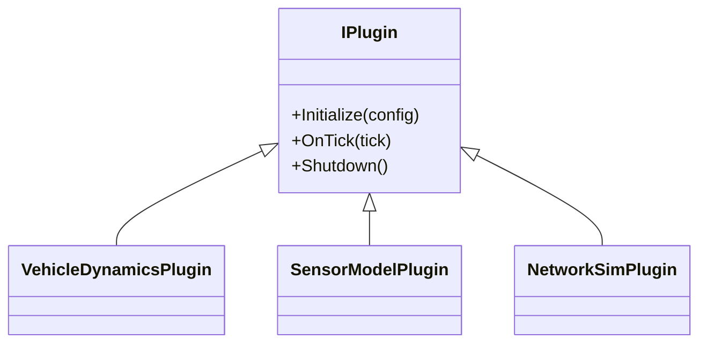
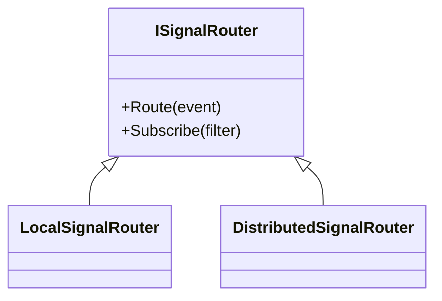
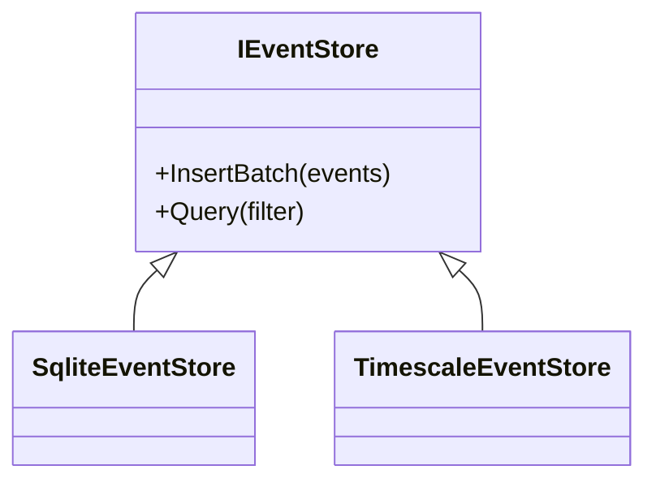
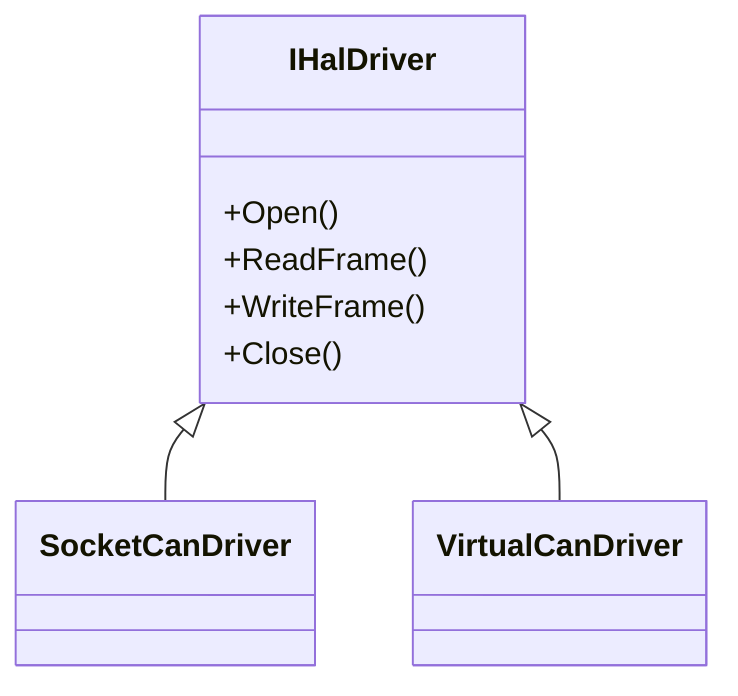

# Class Diagrams

## Plugin Hierarchy

```mermaid
classDiagram
    class IPlugin {
      +Initialize(config)
      +OnTick(tick)
      +Shutdown()
    }
    class VehicleDynamicsPlugin
    class SensorModelPlugin
    class NetworkSimPlugin

    IPlugin <|-- VehicleDynamicsPlugin
    IPlugin <|-- SensorModelPlugin
    IPlugin <|-- NetworkSimPlugin
```

## Signal Router Hierarchy

```mermaid
classDiagram
    class ISignalRouter {
      +Route(event)
      +Subscribe(filter)
    }
    class LocalSignalRouter
    class DistributedSignalRouter

    ISignalRouter <|-- LocalSignalRouter
    ISignalRouter <|-- DistributedSignalRouter
```

## Event Store Hierarchy

```mermaid
classDiagram
    class IEventStore {
      +InsertBatch(events)
      +Query(filter)
    }
    class SqliteEventStore
    class TimescaleEventStore

    IEventStore <|-- SqliteEventStore
    IEventStore <|-- TimescaleEventStore
```

## HAL Driver Hierarchy

```mermaid
classDiagram
    class IHalDriver {
      +Open()
      +ReadFrame()
      +WriteFrame()
      +Close()
    }
    class SocketCanDriver
    class VirtualCanDriver

    IHalDriver <|-- SocketCanDriver
    IHalDriver <|-- VirtualCanDriver
```

