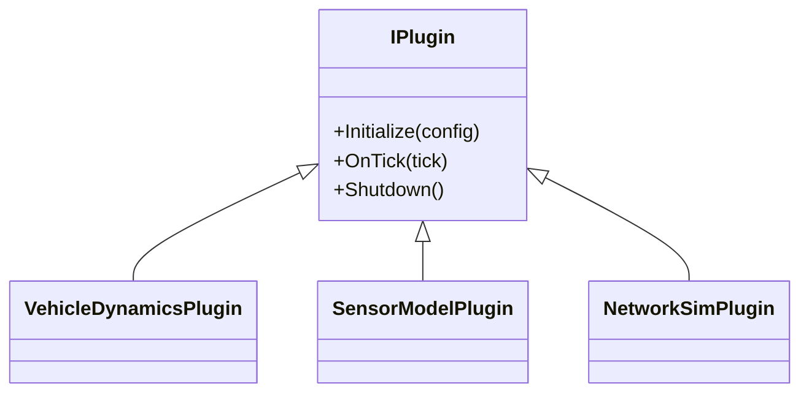
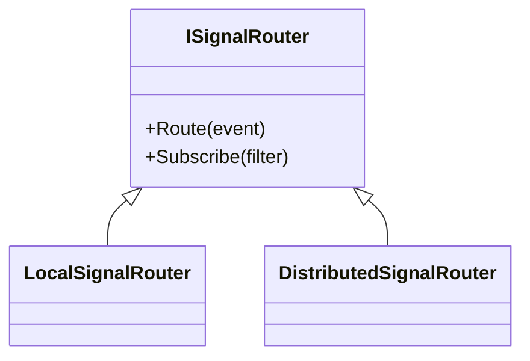
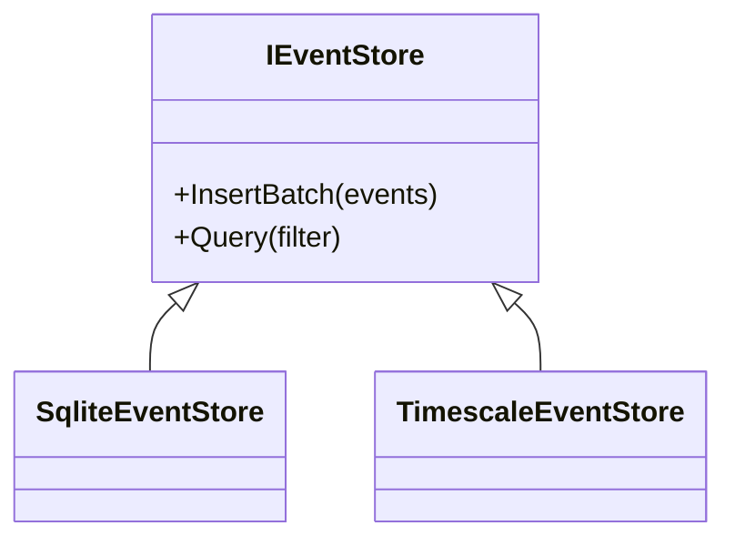
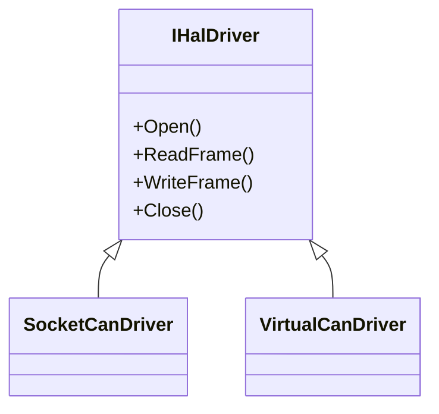

# Class Diagrams

## Plugin Hierarchy

`IPlugin` in this diagram maps to the C ABI dispatch table `BoatPluginVTable`
defined in `sdk/cpp/include/boat/plugin.h`. Implementations expose
`boat_plugin_create`, `boat_plugin_destroy`, and `boat_plugin_abi_version`
entry points and route lifecycle calls through that vtable.

## Signal Router Hierarchy

## Event Store Hierarchy

## HAL Driver Hierarchy

`HilBridge` owns a `shared_ptr<IHalDriver>` and keeps a reference to `EventBus`.
CAN frame events use dedicated discriminators: RX `kEventTypeCanFrameRx = 0xCA1F0001`
and TX `kEventTypeCanFrameTx = 0xCA1F0002`.

