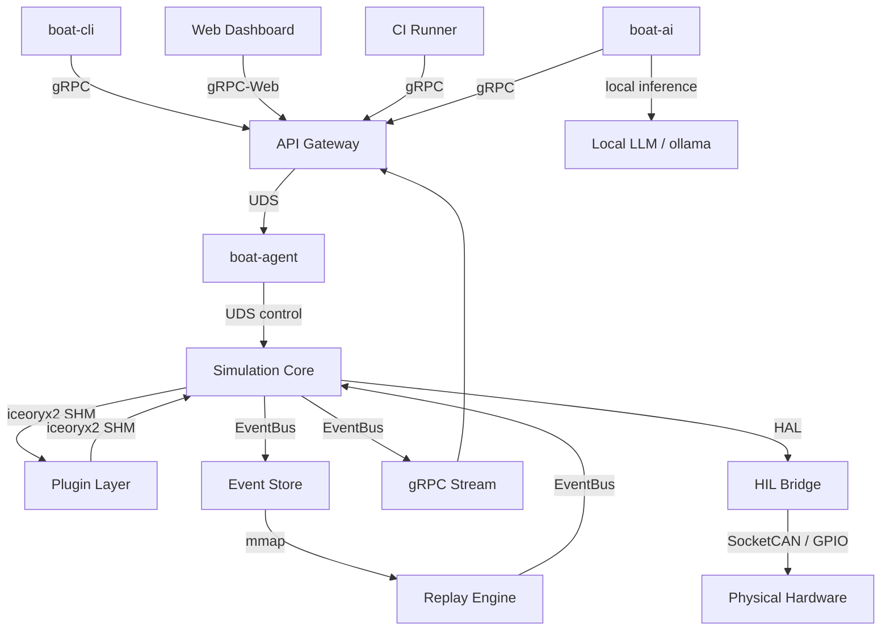

# System Diagram

## ASCII Layered Diagram

```text
┌─────────────────────────────────────────────────────────────────┐
│                        CLIENT LAYER                             │
│   CLI Tool (boat-cli)  │  Web Dashboard  │  External Tools      │
│   Python SDK           │  CI/CD Runners  │  IDE Plugins         │
└────────────────────────┬────────────────────────────────────────┘
                         │ gRPC (HTTP/2 + TLS)
┌────────────────────────▼────────────────────────────────────────┐
│                     API GATEWAY LAYER                           │
│   BoAt gRPC Server  │  Auth/AuthZ  │  Rate Limiting             │
│   REST Transcoding (grpc-gateway)  │  WebSocket bridge          │
└────────────────────────┬────────────────────────────────────────┘
                         │ Unix Domain Sockets (control)
┌────────────────────────▼────────────────────────────────────────┐
│                    SERVICE LAYER                                 │
│  ScenarioService │ SignalService │ TraceService │ PluginService  │
│  ReplayService   │ FaultService │ MetricsService│ ConfigService  │
└────────────────────────┬────────────────────────────────────────┘
                         │ Shared Memory (iceoryx2) + Event Bus
┌────────────────────────▼────────────────────────────────────────┐
│                  SIMULATION CORE (C++)                          │
│  Scheduler (tick-based) │ Signal Router │ Plugin Manager        │
│  Event Bus              │ State Machine │ Determinism Engine     │
│  Time Manager           │ Fault Injector│ Scenario Loader        │
└────────────────────────┬────────────────────────────────────────┘
                         │ Plugin ABI (C stable ABI)
┌────────────────────────▼────────────────────────────────────────┐
│                    PLUGIN LAYER                                  │
│  Vehicle Dynamics Plugin │ Sensor Model Plugin │ Network Plugin  │
│  AUTOSAR Plugin          │ CAN/LIN/Ethernet Plugin │ Custom...   │
└────────────────────────┬────────────────────────────────────────┘
                         │ HAL (Hardware Abstraction Layer)
┌────────────────────────▼────────────────────────────────────────┐
│               HARDWARE ABSTRACTION LAYER                        │
│  HIL Bridge  │  CAN Interface  │  Ethernet Interface            │
│  GPIO/PWM    │  FPGA Bridge    │  Virtual Hardware Stubs        │
└─────────────────────────────────────────────────────────────────┘
                         │
┌────────────────────────▼────────────────────────────────────────┐
│                   PERSISTENCE LAYER                             │
│  Event Store (SQLite/TimescaleDB) │ Config Store (TOML/SQLite)  │
│  Trace Store (binary + index)     │ Artifact Registry            │
└─────────────────────────────────────────────────────────────────┘
```

## Mermaid Component Graph



