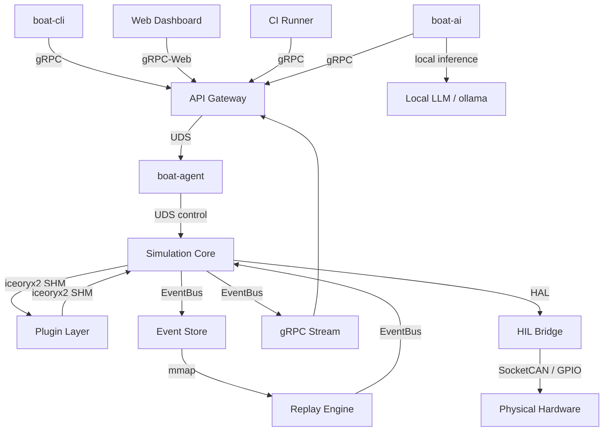

# System Architecture

## Layered Architecture

```text
┌─────────────────────────────────────────────────────────────────┐
│                        CLIENT LAYER                             │
│   CLI Tool (boat-cli)  │  Web Dashboard  │  External Tools      │
│   Python SDK           │  CI/CD Runners  │  IDE Plugins         │
└────────────────────────┬────────────────────────────────────────┘
                         │ gRPC (HTTP/2 + TLS)
┌────────────────────────▼────────────────────────────────────────┐
│                     API GATEWAY LAYER                           │
│   BoAt gRPC Server  │  Auth/AuthZ  │  Rate Limiting             │
│   REST Transcoding (grpc-gateway)  │  WebSocket bridge          │
└────────────────────────┬────────────────────────────────────────┘
                         │ Unix Domain Sockets (control)
┌────────────────────────▼────────────────────────────────────────┐
│                    SERVICE LAYER                                 │
│  ScenarioService │ SignalService │ TraceService │ PluginService  │
│  ReplayService   │ FaultService │ MetricsService│ SimulationService │
└────────────────────────┬────────────────────────────────────────┘
                         │ Shared Memory (iceoryx2) + Event Bus
┌────────────────────────▼────────────────────────────────────────┐
│                  SIMULATION CORE (C++)                          │
│  Scheduler (tick-based) │ Signal Router │ Plugin Manager        │
│  Event Bus              │ State Machine │ Determinism Engine     │
│  Time Manager           │ Fault Injector│ Scenario Loader        │
└────────────────────────┬────────────────────────────────────────┘
                         │ Plugin ABI (C stable ABI)
┌────────────────────────▼────────────────────────────────────────┐
│                    PLUGIN LAYER                                  │
│  Vehicle Dynamics Plugin │ Sensor Model Plugin │ Network Plugin  │
│  AUTOSAR Plugin          │ CAN/LIN/Ethernet Plugin │ Custom...   │
└────────────────────────┬────────────────────────────────────────┘
                         │ HAL (Hardware Abstraction Layer)
┌────────────────────────▼────────────────────────────────────────┐
│               HARDWARE ABSTRACTION LAYER                        │
│  HIL Bridge  │  CAN Interface  │  Ethernet Interface            │
│  GPIO/PWM    │  FPGA Bridge    │  Virtual Hardware Stubs        │
└─────────────────────────────────────────────────────────────────┘
                         │
┌────────────────────────▼────────────────────────────────────────┐
│                   PERSISTENCE LAYER                             │
│  Event Store (SQLite/TimescaleDB) │ Config Store (TOML/SQLite)  │
│  Trace Store (binary + index)     │ Artifact Registry            │
└─────────────────────────────────────────────────────────────────┘
```

## Component Responsibilities

| Component | Language | Responsibility |
|---|---|---|
| `boat-core` | C++20 | Tick scheduler, signal router, determinism engine, SimulationContext |
| `boat-plugin-sdk` | C++20 + C ABI | Plugin interface, lifecycle hooks |
| `boat-gateway` | C++20 | gRPC server, all service implementations |
| `boat-store` | C++20 | Event/trace persistence, query engine |
| `boat-replay` | C++20 | Deterministic replay engine |
| `boat-hil` | C++20 | HIL bridge, CAN/Ethernet driver abstraction, PDU router |
| `boat-py` | Python 3.11+ | Python SDK, gRPC stubs, test helpers |
| `boat-cli` | Python | Command-line interface for all gateway services |
| `boat-ui` | Python (FastAPI) | 10 standalone web dashboards (launcher, dashboard, commander, etc.) |

## Module Tree

```
boat-platform/
├── CMakeLists.txt                  # Root: find_package, add_subdirectory
├── cmake/
│   ├── BoAtPlugin.cmake            # add_boat_plugin() macro
│   ├── BoAtProto.cmake             # protobuf_generate() wrapper
│   └── Packaging.cmake             # CPack config
├── src/
│   ├── core/                       # Scheduler, signal router, event bus, plugin mgr, state machine, determinism, fault, scenario
│   ├── ipc/                        # iceoryx2 SHM, UDS, gRPC server
│   ├── store/                      # SQLite-backed event/trace/config stores
│   ├── replay/                     # ReplayController, TimestampIndex
│   ├── hil/                        # HAL, CAN drivers, PDU router, virtual stubs
│   ├── gateway/grpc_gateway/       # gRPC server entry point
│   └── plugins/                    # vehicle_dynamics, sensor_model, network_sim, can_tp, someip
├── sdk/
│   ├── cpp/include/boat/plugin.h   # Stable C ABI for plugins
│   └── python/                     # boat-py package
├── cli/                            # boat-cli Typer application
├── proto/boat/v1/                  # 15 .proto files
├── config/                         # PDU database JSON files
├── tests/                          # unit, integration, determinism, hil
└── docs/                           # Documentation
```

## Plugin Loading Model

Each plugin is built as a shared library (`.so`) and loaded at runtime via `dlopen`.
The plugin entry point uses a stable C ABI: `boat_plugin_create()`.

This preserves binary compatibility boundaries while allowing internal C++ evolution.

## Component Graph


