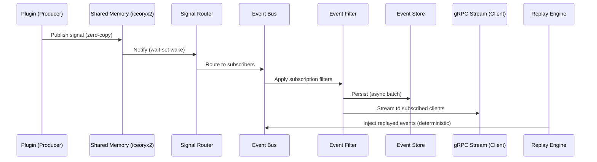

# Data Processing Pipeline

## Pipeline Stages

## Event Ingestion

- Plugins publish on named iceoryx2 topics each tick.
- `SignalRouter` subscribes and routes by `SignalDef.consumers`.
- Throughput target: at least 1M events/sec on an 8-core system.

## Filtering

- Supported filters:
  - `signal_id`
  - `simulation_id`
  - tick range
  - tag key/value
  - value threshold
- Filters are compiled to predicates at subscription time to avoid per-event string parsing.

## Replay (ABI v8, plugin-based)

- `ReplayController` reads binary traces using `mmap`. Each record is a
  length-delimited `boat.v1.Frame` protobuf.
- Records are converted to `core::Frame` and dispatched through
  `PluginManager::DispatchFrame()` at original timestamps (absolute-time
  `timerfd` scheduling). The built-in `FrameForwarderPlugin` receives each frame
  via `on_frame` and forwards it to the CAN/Ethernet bus registries; `SELF_SENT`
  flags prevent dispatch loops.
- Determinism controls:
  - fixed RNG seed
  - fixed tick order
  - no wall-clock dependency
- Replay speeds:
  - 1x real-time
  - Nx accelerated
  - step-by-step

